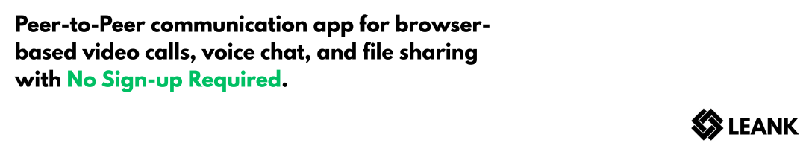
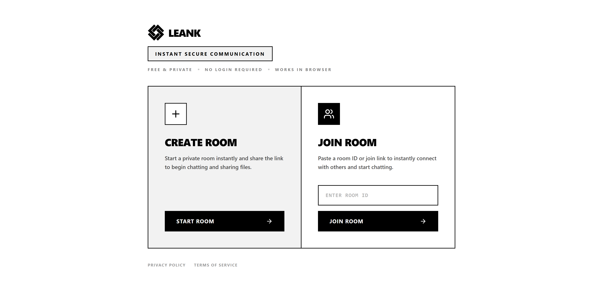
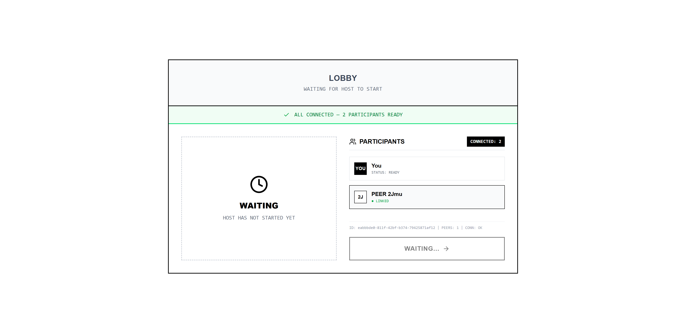
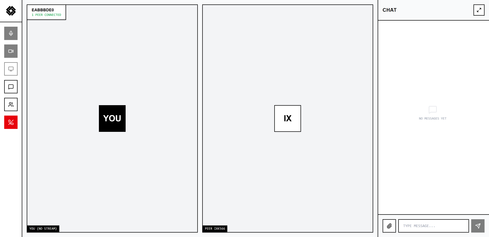
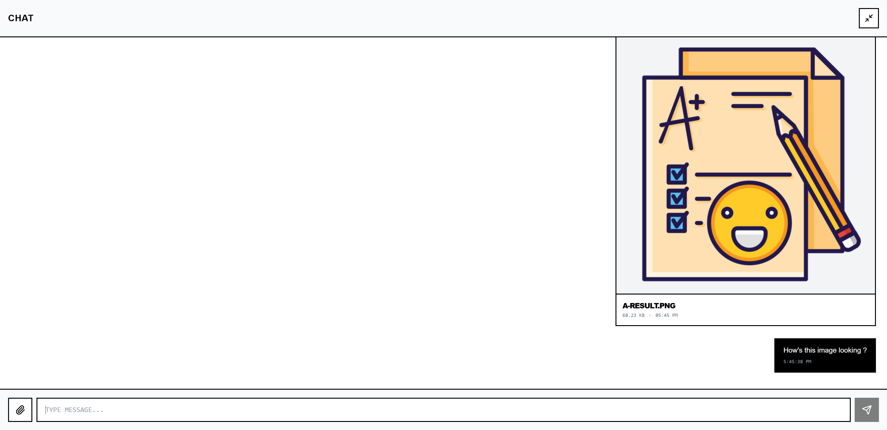
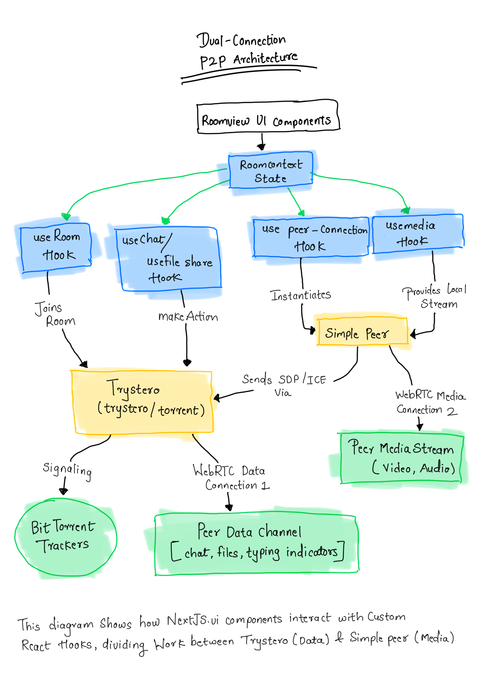
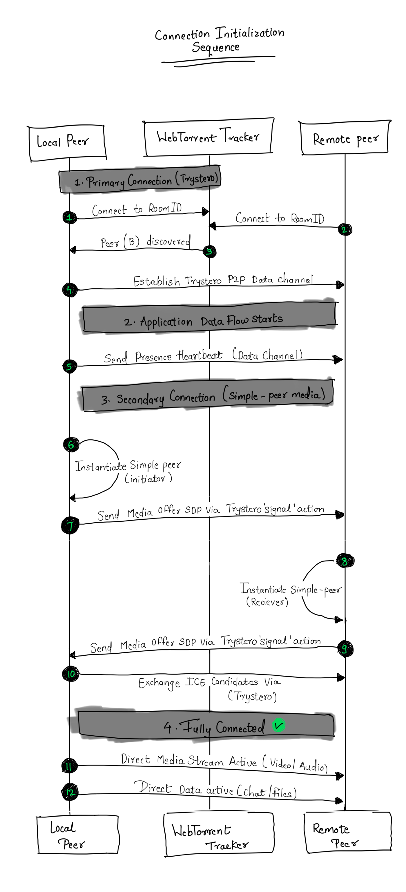
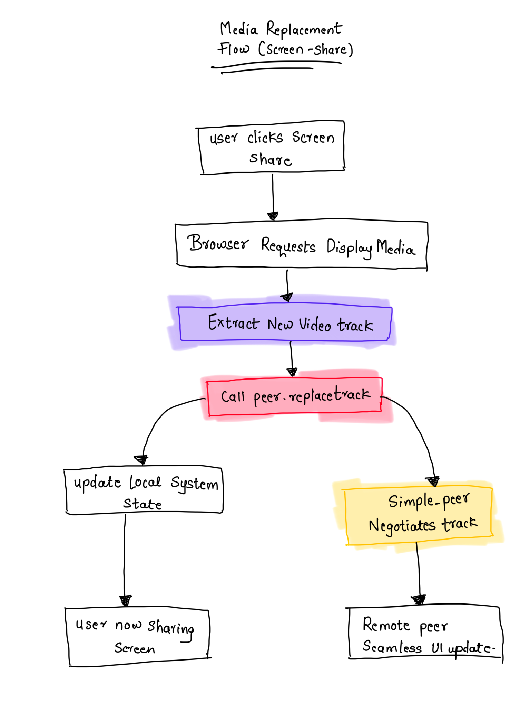

Leank is a strictly Peer-to-Peer communication app for browser-based video calls, voice chat, and file sharing with zero backend storage.

## USP

- **Zero Backend**: Data flows directly between users via WebRTC and `simple-peer`. No central server records or stores information.
- **No Sign-up Required**: Create instant, ad-hoc sessions using securely generated room IDs.
- **High Performance**: Built with Next.js and optimized for modern browsers.
- **Neo-Brutalist Design**: Minimalist visual style using clear, high-contrast, black-and-white functional elements.
- **Encrypted Data Transfer**: Securely share your screen, send text, or transfer files directly to connected peers without intermediary access.

## Technology Stack

- **Framework**: [Next.js](https://nextjs.org/) (React 19)
- **Styling**: [Tailwind CSS v4](https://tailwindcss.com/)
- **Icons**: [Lucide React](https://lucide.dev/)
- **P2P Communication**: [`simple-peer`](https://github.com/feross/simple-peer) & [`trystero`](https://github.com/dmotz/trystero)
- **Tooling**: TypeScript, ESLint

## Application Interface

Here is a glimpse of the application's minimalist interface in action:

<div align="center">
  
  
  
  
</div>

## Architecture Overview

Leank operates on a **Dual WebRTC Connection** to function entirely without a central server. This section outlines how the application handles data and video streams. 

### 1. Connection Structure

Rather than routing data through a central company server, Leank establishes a direct connection to the person you are communicating with.

- **Text and Files**: We use a library called `trystero`, which relies on the BitTorrent network to locate peers and transmit text or files directly.
- **Video and Audio**: We utilize `simple-peer`, which operates over the initial connection to create a dedicated, high-quality channel specifically for camera and microphone data.



### 2. Session Initialization

The following outlines the process of connecting two browsers when joining a room:

1. **Peer Discovery**: Both participants connect to a public "Tracker" (acting as a directory) and search for the same Room ID.
2. **Address Exchange**: Once discovered, the Tracker facilitates the exchange of technical routing information (ICE candidates and Session Description Protocols).
3. **Direct Connection Established**: After the addresses are exchanged, the Tracker disconnects. The browsers are now linked in a direct, encrypted session.



### 3. Screen Sharing Mechanism

When a user initiates screen sharing during a video call, Leank does not create a secondary connection. Instead, it dynamically swaps the camera feed for the screen capture feed on the fly, maintaining an uninterrupted connection.



## Local Setup

Ensure Node.js 18+ is installed system-wide. Install the project dependencies:

```bash
npm install
```

Run the development server:

```bash
npm run dev
```

Navigate to [http://localhost:3000](http://localhost:3000) in your browser to view the application locally. Layout and logic changes will automatically update in the browser.

Built with ❤️ by:

- **[Developer 1 Name]** - [GitHub Profile Link]
- **[Developer 2 Name]** - [GitHub Profile Link]
